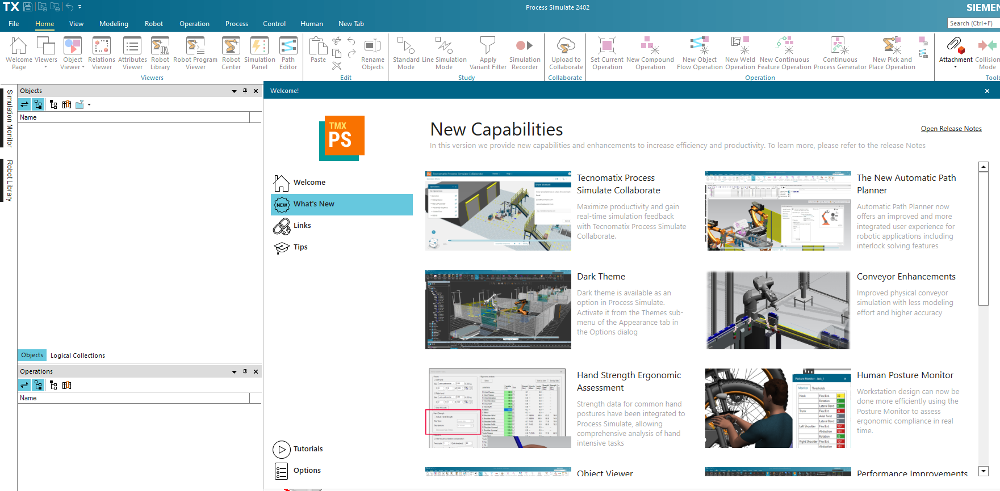
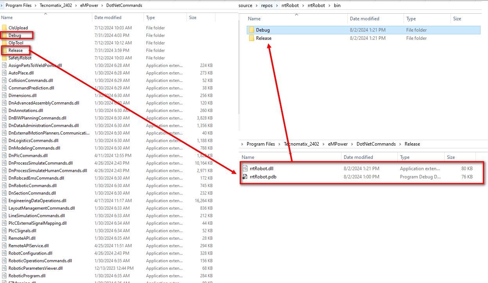
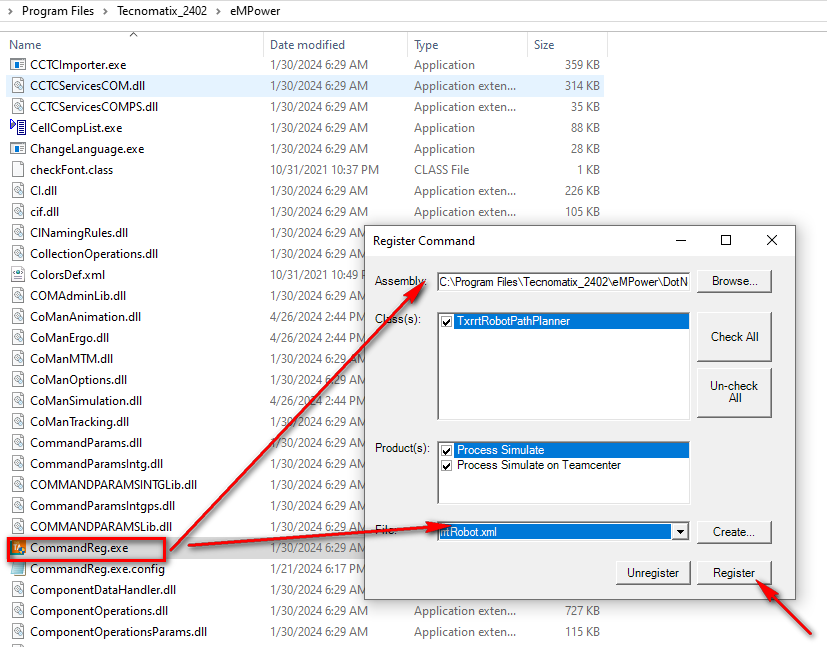
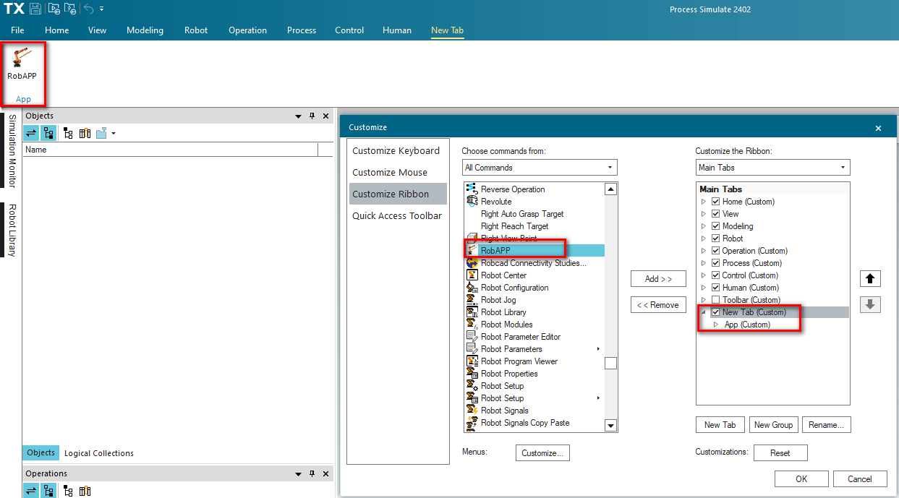
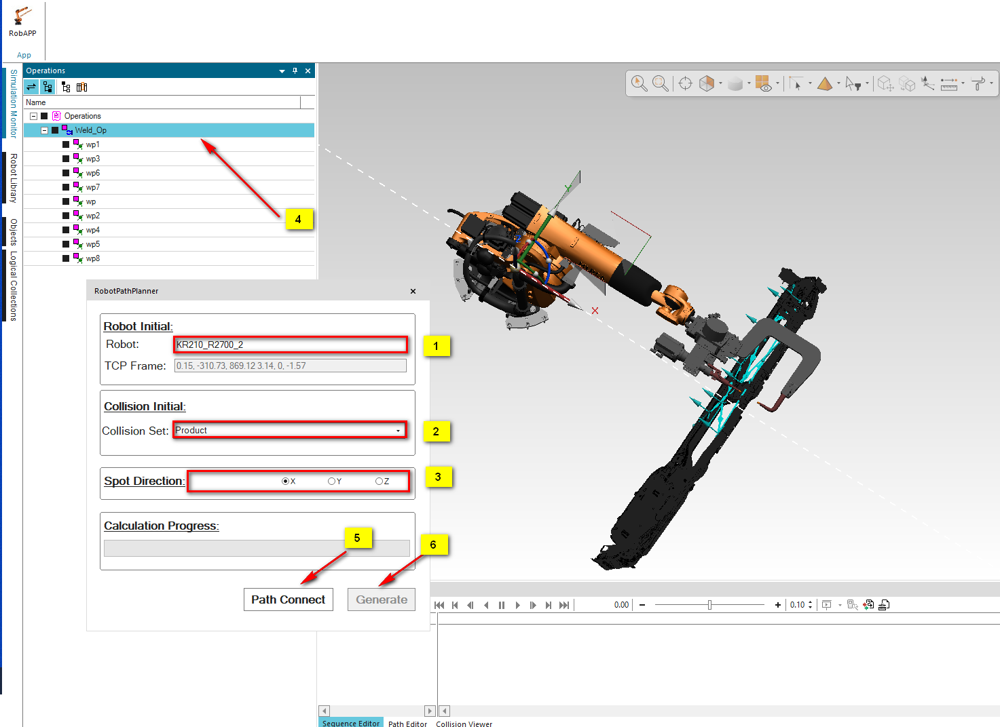

# Industry-Robot-Auto-Path-Planner

<b>Introduction</b>
Develop Industry Robot (KUKA/KAWASAKI/ABB/FANUC) Auto path planner APP integrated into Robot Simulation platform Tecnomatix process simulate software to generate Robot Path automaticlly.
Currently the path which can be generated is only focus onto Spot Welding path, and the Tool or Gun mounted on Robot should be Server Welding Gun;
The Path Planner Coding/Arithmetic is base on [RRT* Connect 3D](https://github.com/WYoseanLove/RRT-_Connect_3D.git), which is modifed for 7 degree freedom including (TX, TY, TZ, RX, RY, RZ, GunOpening);
Industry Robot Forward/Inverse kinematic calculation is directly taken the function from Tecnomatix API, but the user can also reference the coding [Industrial Robot Forward and Inverse Kinematic Calculation](https://github.com/WYoseanLove/Industrial-Robot-Forward-and-Inverse-Kinematic-Calculation.git)generated the dll and re-call it, but the robot DH model should be setup correctly;
The Collison test and calculation is directly taken the function from Tecnomatix API.
Since the Tecnomatix does not support for multiple Thread, so the app is taken Async/Await method for progress bar;

<b>System SetUp</b>
Before Taken the app, you should install SIEMENS Tecnomatix Process simulate, the version in my laptop is 2402, different version the App UI will be different 

The Coding for RRTRobot release the dll file should be copied to folder "C:\Program Files\Tecnomatix_2402\eMPower\DotNetCommands";

Go back to folder "eMPower" to register the dlll command;

Then you can open the Process simualte software to add the command into the Tool Bar, pleae right click the top Tool bar "Customize Ribbon", found the RobApp ine the left list and add it to "Customize the Ribbon" list;

Untill now all the setup is finished

<b>UI Introduction</b>

below is to explain how to use the App to do the path planner:
1. Robot:  please select the robot in the Viewer, and the Robot name & TCP Frame will be automaticlly into the text;
   please note: the weld gun used to calculate the Robot path should be only mounted on the Robot, if the Robot have multiple guns, all will be unmounted and request you mount only one;
2. Collision: The system will consider the gun and Robot as Collision Src, here you need select which is the Collision Target, of course you can select multiple collision target, and all of them will be considerde during calculation;
3. Spot direction: this is cirtical setup, the app will be add pass point if the rrt connect not calculate path result after 1000 iteration, the direction will decide along which weld spot aix the Robot will escape.
For example in the snap, all the spots are in front of Robot, and the Robot can be excape the collision target along the X aix according Robot base frame. So here will be select "X";
4. select which Op will be calculated;
5. Click "Path Connect"
6. When Finish calculated, click "Generate"
Note: if some spots in Op can not calculated, those of spots will be removed from Op ;

