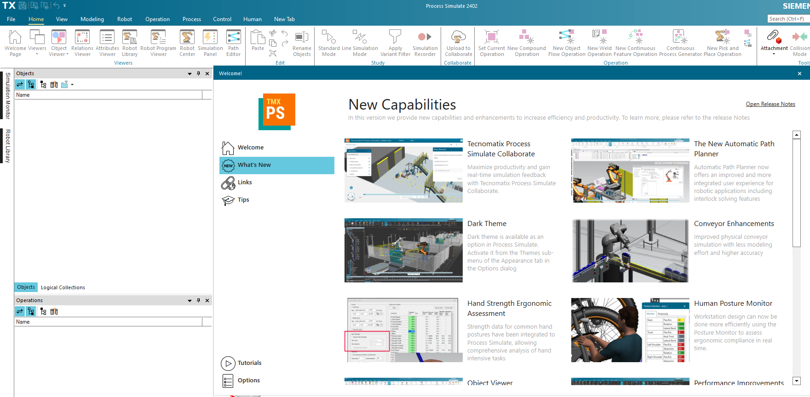
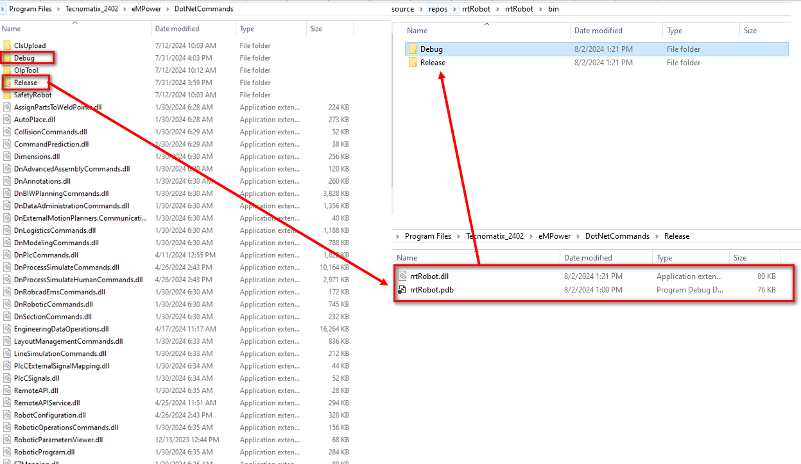
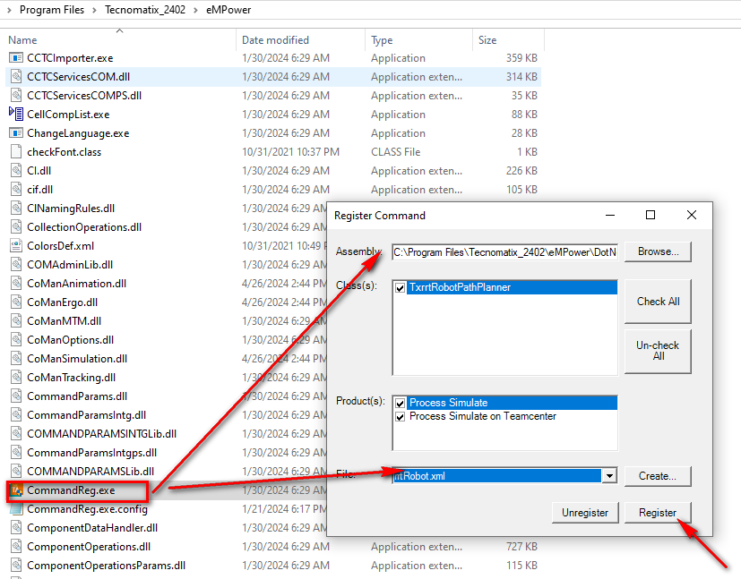
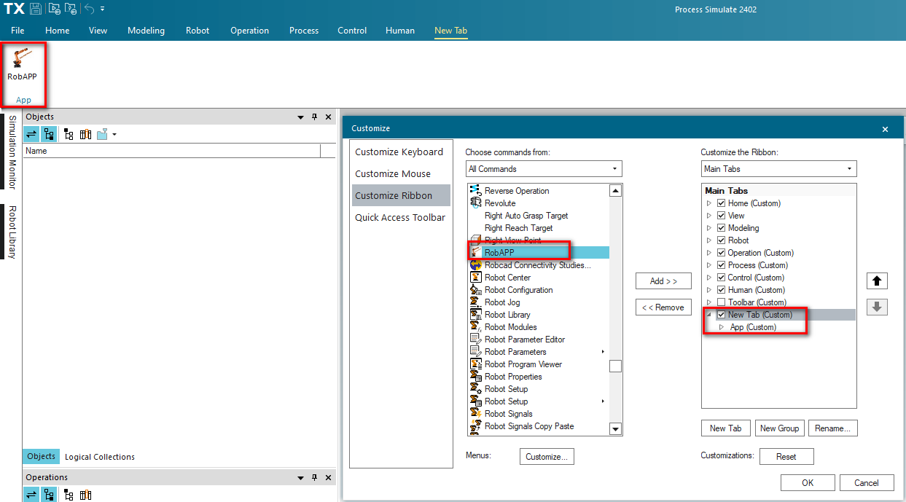
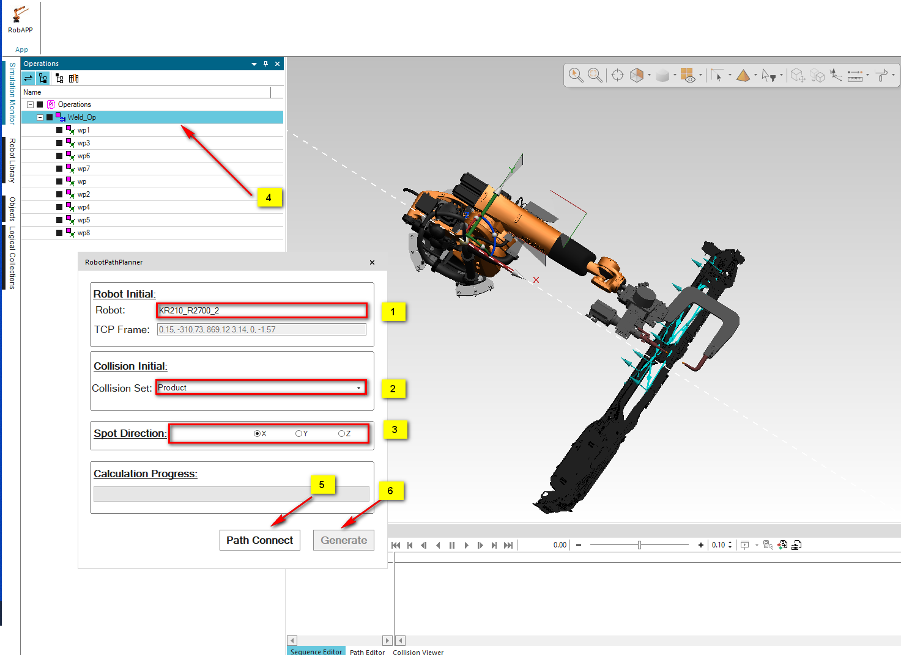

# Industry-Robot-Auto-Path-Planner

<b>Introduction</b>
Develop Industry Robot (KUKA/KAWASAKI/ABB/FANUC) Auto path planner APP integrated into Robot Simulation platform Tecnomatix process simulate software to generate Robot Path automaticlly.
Currently the path which can be generated is only focus onto Spot Welding path, and the Tool or Gun mounted on Robot should be Server Welding Gun;
The Path Planner Coding/Arithmetic is base on [RRT* Connect 3D](https://github.com/WYoseanLove/RRT-_Connect_3D.git), which is modifed for 7 degree freedom including (TX, TY, TZ, RX, RY, RZ, GunOpening);
Industry Robot Forward/Inverse kinematic calculation is directly taken the function from Tecnomatix API, but the user can also reference the coding [Industrial Robot Forward and Inverse Kinematic Calculation](https://github.com/WYoseanLove/Industrial-Robot-Forward-and-Inverse-Kinematic-Calculation.git)generated the dll and re-call it, but the robot DH model should be setup correctly;
The Collison test and calculation is directly taken the function from Tecnomatix API.
Since the Tecnomatix does not support for multiple Thread, so the app is taken Async/Await method for progress bar;

<b>System SetUp</b>
Before Taken the app, you should install SIEMENS Tecnomatix Process simulate, the version in my laptop is 2402, different version the App UI will be different 

The Coding for RRTRobot release the dll file should be copied to folder "C:\Program Files\Tecnomatix_2402\eMPower\DotNetCommands";

Go back to folder "eMPower" to register the dlll command;

Then you can open the Process simualte software to add the command into the Tool Bar, pleae right click the top Tool bar "Customize Ribbon", found the RobApp ine the left list and add it to "Customize the Ribbon" list;

Untill now all the setup is finished

<b>UI Introduction</b>

below is to explain how to use the App to do the path planner:
1. Robot:  please select the robot in the Viewer, and the Robot name & TCP Frame will be automaticlly into the text;
   please note: the weld gun used to calculate the Robot path should be only mounted on the Robot, if the Robot have multiple guns, all will be unmounted and request you mount only one;
2. Collision: The system will consider the gun and Robot as Collision Src, here you need select which is the Collision Target, of course you can select multiple collision target, and all of them will be considerde during calculation;
3. Spot direction: this is cirtical setup, the app will be add pass point if the rrt connect not calculate path result after 1000 iteration, the direction will decide along which weld spot aix the Robot will escape.
For example in the snap, all the spots are in front of Robot, and the Robot can be excape the collision target along the X aix according Robot base frame. So here will be select "X";
-----from version 2.0, the spot direction is removed, since the sofware will calculate the escape direction by itself
4. select which Op will be calculated;
5. Click "Path Connect"
6. When Finish calculated, click "Generate"
Note: if some spots in Op can not calculated, those of spots will be removed from Op ;

---

# Supplementary README / 补充说明文档

> This section is an additional documentation for the project.  
> 本节为项目的补充说明文档，不替换原有 README，仅用于补充更完整的项目介绍、架构说明、使用流程与开发说明。

---

## 1. Project Overview / 项目概述

**Industry-Robot-Auto-Path-Planner** is a Tecnomatix Process Simulate plugin for automatic industrial robot path planning.  
**Industry-Robot-Auto-Path-Planner** 是一个基于 **Siemens Tecnomatix Process Simulate** 开发的工业机器人自动路径规划插件。

The current implementation mainly focuses on:

- automatic transition path generation between weld points  
- spot welding path planning with servo welding gun  
- collision-aware robot joint path generation  
- intermediate via point generation and path post-processing  

当前实现主要聚焦于：

- 焊点之间过渡轨迹自动生成  
- 伺服焊钳点焊场景路径规划  
- 考虑碰撞检测的机器人关节空间路径生成  
- 过渡点生成与轨迹后处理优化  

The planner is built on an extended **RRT* Connect** idea and integrates:

- Tecnomatix collision detection API  
- Tecnomatix robot forward / inverse kinematics  
- PTP interpolation logic  
- local path repair strategy  
- adaptive step-size adjustment  
- APF (Artificial Potential Field) assistance  

路径规划算法基于扩展的 **RRT* Connect** 思想，并融合了：

- Tecnomatix 碰撞检测接口  
- Tecnomatix 机器人正逆解能力  
- PTP 插补逻辑  
- 局部路径修复策略  
- 自适应步长调节  
- APF 人工势场辅助搜索  

---

## 2. Application Scenario / 适用场景

This project is designed for automatic robot path generation in industrial offline simulation environments, especially for:

- spot welding production lines  
- servo gun mounted robot applications  
- multi-obstacle robot transition planning  
- Process Simulate based path validation and generation  

本项目适用于工业离线仿真环境中的机器人自动轨迹生成，尤其适合：

- 点焊产线  
- 安装伺服焊钳的工业机器人  
- 多障碍物环境下的机器人过渡路径规划  
- 基于 Process Simulate 的路径验证与生成  

> At present, the code is more suitable for welding path planning than general-purpose robotic motion planning.  
> 当前代码更偏向焊接工艺场景，不是完全通用的机器人运动规划框架。

---

## 3. Core Features / 核心功能

### 3.1 Automatic Path Planning / 自动路径规划
Generate robot transition motion between adjacent welding locations automatically.  
在相邻焊点之间自动生成机器人过渡运动路径。

### 3.2 Collision Checking / 碰撞检测
The planner uses Tecnomatix API to verify whether a sampled robot posture or interpolated segment is collision-free.  
规划过程中调用 Tecnomatix API 对采样姿态和插补路径进行碰撞检测。

### 3.3 Joint-space Planning / 关节空间规划
The path is mainly planned in robot joint space, which is suitable for robot posture continuity and simulation execution.  
路径主要在机器人关节空间中规划，更适合机器人姿态连续性和仿真执行。

### 3.4 PTP Interpolation Validation / PTP 插补校验
A path segment is not only checked by node validity, but also by interpolation validity between two joint states.  
路径段不仅检查端点有效性，还检查两个关节姿态之间插补过程是否有效。

### 3.5 RRT* Connect Based Search / 基于 RRT* Connect 的搜索
The planner uses a bidirectional tree expansion strategy and introduces cost optimization logic for parent updating.  
规划器采用双向树扩展策略，并引入代价优化逻辑更新父节点关系。

### 3.6 APF Assisted Sampling / APF 势场辅助采样
Artificial Potential Field is used to bias the extension direction toward goal and away from obstacle-related regions.  
引入人工势场，使扩展方向更倾向目标并避开障碍相关区域。

### 3.7 Adaptive Step Size / 自适应步长
The planner adjusts tree extension step sizes based on recent sampling performance.  
根据近期扩展效果动态调整树扩展步长。

### 3.8 Local Recovery / 局部修复
When direct extension fails, the planner may try local path planning to rescue the current expansion.  
当直接扩展失败时，规划器会尝试局部路径修复以提升成功率。

### 3.9 Via Point Generation / 过渡点生成
After planning, path points can be converted into robotic via locations for Process Simulate operations.  
规划完成后，可将结果路径转换为 Process Simulate 中的机器人过渡点。

### 3.10 Operation Optimization / 工序优化
The project includes post-processing logic to optimize intermediate path points in weld operations.  
项目包含对焊接工序中过渡点的后处理优化逻辑。

---

## 4. Technical Architecture / 技术架构

The project is mainly implemented as a .NET Framework plugin integrated into Tecnomatix Process Simulate.  
本项目主要以 .NET Framework 插件形式集成到 Tecnomatix Process Simulate 中。

### Main technical stack / 主要技术栈

- **C#**
- **.NET Framework 4.8**
- **Windows Forms**
- **Siemens Tecnomatix Engineering API**

### Runtime dependency / 运行依赖

- Siemens Tecnomatix Process Simulate
- Correct robot model and tool setup
- Collision objects prepared in the simulation scene
- Proper DLL deployment and command registration

---

## 5. Important Classes / 重要类说明

Below is a practical overview of major classes in the current codebase.  
下面结合当前代码，对几个关键类做说明。

### `TxrrtRobotPathPlannerForm`
Main UI form and workflow entry.  
主界面窗体与流程入口。

Responsibilities / 职责：

- selecting robot and collision targets  
- selecting weld operations to calculate  
- launching path connection process  
- generating output path into Process Simulate  
- maintaining global runtime data such as:
  - `robot`
  - `collisionSrc`
  - `collisionTar`
  - `fullpath`
  - `Pathend_nodes`
  - `ToolJointOpening`

### `TxRobotRRTConnectJoint`
Core path planning class in joint space.  
关节空间路径规划核心类。

Responsibilities / 职责：

- bidirectional RRT expansion  
- nearest node search  
- tree extension  
- collision validation  
- APF-based biasing  
- adaptive step-size handling  
- path extraction  
- minimal cost parent optimization  

### `TxRobotptpPathCal`
PTP interpolation and joint trajectory calculation helper.  
PTP 插补及关节轨迹计算辅助类。

Responsibilities / 职责：

- joint delta calculation  
- PTP time estimation  
- interpolated robot joint data generation  
- servo gun related interpolation support  

### `TxRobotPathOptimizePtp`
Path optimization / simplification for generated operation path.  
用于对生成后的工艺轨迹进行过渡点优化与精简。

### `TxRobotAPIClass`
Wrapper/helper for Tecnomatix API related operations.  
Tecnomatix API 相关操作的封装辅助类。

---

## 6. Algorithm Summary / 算法说明

### 6.1 Basic Idea / 基本思路

The planner connects two robot joint states using a bidirectional search tree.  
规划器通过双向搜索树连接两个机器人关节姿态。

General flow / 总体流程：

1. initialize start tree and goal tree  
2. randomly sample a candidate robot joint posture  
3. extend one tree toward the sample  
4. validate the motion segment with collision checking and interpolation checking  
5. try to connect the opposite tree  
6. if connected, extract final path  
7. optionally optimize or simplify the generated path  

### 6.2 Cost Optimization / 代价优化

A node is first connected using a natural parent (usually nearest or last node), then `minimal_cost()` is used to check whether a better parent exists in a local neighborhood.  
新节点先按默认父节点接入，再通过 `minimal_cost()` 在局部邻域中寻找代价更优的父节点。

This makes the implementation closer to **RRT\*** behavior than plain RRT-Connect.  
这使得实现相比普通 RRT-Connect，更接近 **RRT\*** 的代价优化思想。

### 6.3 APF Guided Expansion / APF 引导扩展

The algorithm computes:

- attractive force to goal  
- attractive force to opposite tree nearby node  
- repulsive force from obstacle-related samples  

算法综合计算：

- 指向目标点的引力  
- 指向对侧树邻近点的引力  
- 来自障碍相关样本的斥力  

The resulting normalized direction is used to modify the expansion target.  
最终归一化方向用于修正扩展目标。

### 6.4 Adaptive Step Control / 自适应步长控制

The system records recent successful and failed expansions, then adjusts start-tree and end-tree step size independently.  
系统记录近期扩展成功/失败情况，并对起始树和目标树步长分别进行独立调整。

This helps improve convergence in narrow or complex collision environments.  
这有助于在狭窄空间或复杂碰撞环境中提升收敛效果。

### 6.5 Local Path Planning / 局部路径规划

If a direct extension is blocked, the planner may try a short local repair strategy with APF assistance.  
当直接扩展被阻挡时，规划器可能结合 APF 尝试短距离局部修复。

This improves robustness when the sampled direction is reasonable but direct interpolation fails.  
在采样方向合理但直接插补失败时，这种方法可以提升鲁棒性。

---

## 7. Data Flow / 数据流说明

A simplified data flow is as follows:  
简化后的数据流如下：

flowchart TD A["Select Robot / 选择机器人"] --> B["Select Collision Targets / 选择碰撞对象"] B --> C["Select Weld Operation / 选择焊接工序"] C -->
D["Extract Start/End Robot Joint Poses / 提取起止关节姿态"] D --> E["Run RRT Connect Planner / 执行RRT规划"] E --> F["Generate Path Points / 生成路径点"] F --> 
G["Create Via Locations / 生成过渡点"] G --> H["Optimize Operation Path / 优化工艺路径"]

---

## 8. Installation Guide / 安装说明

### 8.1 Prerequisites / 前置条件

Please make sure the following software/environment is ready:

- Windows
- .NET Framework 4.8 runtime
- Siemens Tecnomatix Process Simulate
- Correct robot model and welding gun setup

请确保以下环境已准备：

- Windows 系统
- .NET Framework 4.8 运行环境
- Siemens Tecnomatix Process Simulate
- 正确配置的机器人模型与焊钳工具

### 8.2 Build / 编译

Build the project in Visual Studio with the correct Tecnomatix references.  
在 Visual Studio 中，配置好 Tecnomatix 相关引用后编译项目。

### 8.3 Deploy DLL / 部署 DLL

Copy the built DLL into the Tecnomatix command folder, for example:

将编译好的 DLL 拷贝到 Tecnomatix 的命令文件夹中，例如：

C:\Program Files\Tecnomatix_2402\eMPower\DotNetCommands

将编译得到的 DLL 复制到 Tecnomatix 对应命令目录，例如：

C:\Program Files\Tecnomatix_2402\eMPower\DotNetCommands

### 8.4 Register Command / 注册命令

Register the plugin command in Tecnomatix according to your Process Simulate setup.  
根据你的 Process Simulate 版本完成插件命令注册。

### 8.5 Add to Ribbon / 添加到工具栏

Open Process Simulate and add the command to Ribbon or toolbar via customization.  
打开 Process Simulate，通过自定义功能区把命令加入工具栏。

---

## 9. Basic Workflow / 基本使用流程

### Step 1. Select Robot / 选择机器人
Pick the target robot in the viewer.  
在 Viewer 中选中需要计算轨迹的机器人。

### Step 2. Verify Tool / 检查工具
Ensure the mounted tool is the servo welding gun used for path planning.  
确认机器人上安装的是用于规划的伺服焊钳。

### Step 3. Select Collision Targets / 选择碰撞对象
Add all parts/fixtures/objects that should be considered during collision checking.  
添加所有需要参与碰撞检测的工件、夹具、治具和环境对象。

### Step 4. Select Weld Operation / 选择焊接工序
Choose the weld operation that contains the target weld points.  
选择包含目标焊点的焊接工序。

### Step 5. Run Path Connect / 执行路径连接
Click **Path Connect** to start automatic path planning between points.  
点击 **Path Connect** 开始自动生成焊点之间的过渡路径。

### Step 6. Generate Path / 生成轨迹
After successful calculation, click **Generate** to create operation path/via points.  
路径计算成功后点击 **Generate** 生成工艺轨迹与过渡点。

### Step 7. Validate Result / 检查结果
Check generated path visually and verify simulation/collision behavior.  
检查生成路径的可视化结果，并验证仿真和碰撞情况。

---

## 10. Input Requirements / 输入要求

For better planning results, the following conditions are recommended:  
为了获得更稳定的规划结果，建议满足以下条件：

- Robot model is valid in Process Simulate  
- TCP / Tool frame is configured correctly  
- Base frame is valid  
- Servo gun opening parameter is available  
- Weld points are reachable by robot kinematics  
- Collision scene objects are complete and accurate  

建议确保：

- 机器人模型在 Process Simulate 中可正常求解  
- TCP / Tool Frame 设置正确  
- Base Frame 合理  
- 焊钳开口参数可用  
- 焊点在机器人可达范围内  
- 碰撞场景对象完整准确  

---

## 11. Output Description / 输出结果说明

Typical outputs include:

- a list of joint-space path points  
- generated via points between weld locations  
- updated weld operation trajectory  
- log records under user Documents folder  

典型输出包括：

- 一组关节空间路径点  
- 焊点之间自动生成的过渡点  
- 更新后的焊接工序轨迹  
- 保存在用户 Documents 目录下的日志文件  

The log folder is typically created under:

Documents\rrtRobot

日志目录通常位于：

Documents\rrtRobot

---

## 12. Logging / 日志说明

The project writes runtime information into log files for debugging and analysis.  
项目会将运行过程中的信息写入日志文件，便于调试与分析。

Possible log content may include:

- path generation progress  
- random sample information  
- interpolation joint values  
- path re-calculation records  

日志可能包括：

- 路径生成进度  
- 随机采样信息  
- 插补关节值  
- 重算记录  

You can extend or customize logging according to your own debugging requirements.  
可根据实际调试需要自行扩展日志内容。

---

## 13. Current Limitations / 当前限制

### 13.1 Welding-focused / 偏向焊接场景
The current implementation is mainly designed for spot welding workflows.  
当前实现主要面向点焊流程。

### 13.2 Tecnomatix Dependency / 依赖 Tecnomatix
The plugin strongly depends on Tecnomatix APIs and simulation environment.  
插件强依赖 Tecnomatix API 与仿真环境。

### 13.3 Single Environment Integration / 单环境集成
The code is not a standalone planner library yet.  
当前代码还不是独立可复用的通用规划库。

### 13.4 Performance Constraints / 性能限制
Complex environments may still require many iterations, especially in narrow passages.  
复杂环境下仍可能需要较多迭代，特别是在狭窄空间中。

### 13.5 Threading Constraints / 线程限制
Since Tecnomatix integration has environment restrictions, multi-thread acceleration is limited.  
由于 Tecnomatix 集成环境限制，多线程加速能力受限。

---

## 14. Recommended Future Improvements / 后续优化建议

Possible future enhancements:

- support more robot applications beyond spot welding  
- support better path smoothing after RRT generation  
- improve cost model with time / posture / collision margin  
- add configuration file support  
- improve UI feedback and progress details  
- provide benchmark scenes and sample projects  
- support more robust fallback strategies  
- export path report automatically  

后续可考虑增强：

- 支持更多非点焊机器人应用  
- 增强 RRT 后的平滑处理  
- 将代价函数扩展为时间/姿态/安全余量联合模型  
- 增加配置文件支持  
- 优化 UI 反馈和进度展示  
- 提供标准测试场景和示例工程  
- 增强失败回退策略  
- 自动导出路径报告  

---

## 15. Developer Notes / 开发说明

### Codebase characteristics / 代码特征

- built on **.NET Framework 4.8**
- integrated with **Tecnomatix Process Simulate**
- uses Windows Forms UI
- algorithm and UI logic are relatively tightly coupled

代码特征如下：

- 基于 **.NET Framework 4.8**
- 集成 **Tecnomatix Process Simulate**
- 使用 Windows Forms
- 算法逻辑与 UI / 工艺逻辑耦合较紧

### Suggestions for contributors / 对贡献者的建议

Before making changes, it is recommended to understand:

- Tecnomatix object model
- robot pose and location data flow
- collision pair setup logic
- weld operation structure
- current RRT tree data structure and path extraction logic

建议在修改前先熟悉：

- Tecnomatix 对象模型  
- 机器人姿态与位置数据流  
- 碰撞对配置逻辑  
- 焊接工序结构  
- 当前 RRT 树结构和路径提取逻辑  

---

## 16. Troubleshooting / 常见问题排查

### Q1. No path generated / 无法生成路径
Possible reasons:

- collision targets are too restrictive  
- selected robot/tool is incorrect  
- weld points are unreachable  
- tool frame / TCP settings are wrong  
- environment is too narrow for current sampling strategy  

可能原因：

- 碰撞对象设置过严  
- 选中的机器人或工具不正确  
- 焊点不可达  
- Tool Frame / TCP 设置错误  
- 环境过于狭窄，当前采样策略难以搜索成功  

### Q2. Path generation is too slow / 路径生成过慢
Possible reasons:

- too many collision objects  
- narrow passages or cluttered scene  
- difficult weld posture transitions  
- too many failed interpolations  

可能原因：

- 碰撞对象过多  
- 狭窄空间或场景过于复杂  
- 焊点姿态变化过大  
- 插补段失败过多  

### Q3. Generated path looks strange / 路径看起来不自然
Possible reasons:

- joint-space planning may introduce posture detours  
- via point optimization is insufficient  
- current cost model is distance-dominant  

可能原因：

- 关节空间规划可能带来姿态绕行  
- 过渡点优化不足  
- 当前代价模型主要以距离为主  

### Q4. DLL cannot be loaded / DLL 无法加载
Possible reasons:

- DLL not copied to correct folder  
- missing dependent assemblies  
- version mismatch with Process Simulate  
- command registration not completed  

可能原因：

- DLL 未复制到正确目录  
- 缺少依赖程序集  
- 与 Process Simulate 版本不匹配  
- 命令注册未完成  

---

## 17. Versioning Note / 版本说明

The current assembly version in code is:

- `1.0.0.0`

当前代码中的程序集版本为：

- `1.0.0.0`

If you plan to publish formal releases, it is recommended to maintain:

- semantic versioning
- release notes
- compatibility notes for different Tecnomatix versions

如果后续准备正式发布，建议维护：

- 语义化版本号  
- 发布说明  
- 不同 Tecnomatix 版本兼容说明  

---

## 18. References / 参考资料

### Algorithm Reference / 算法参考
- [RRT* Connect 3D](https://github.com/WYoseanLove/RRT-_Connect_3D.git)

### Kinematics Reference / 运动学参考
- [Industrial Robot Forward and Inverse Kinematic Calculation](https://github.com/WYoseanLove/Industrial-Robot-Forward-and-Inverse-Kinematic-Calculation.git)

### Platform Reference / 平台参考
- Siemens Tecnomatix Process Simulate documentation

---

## 19. Disclaimer / 声明

This project is intended for engineering simulation and development research usage.  
本项目主要面向工程仿真与开发研究用途。

Users should validate generated robot paths carefully before using them in actual production environments.  
在实际生产场景中使用前，用户应对生成轨迹进行充分验证。

Collision-free planning results in simulation should still be reviewed against real-world production constraints.  
即使仿真中无碰撞，也仍需结合真实现场约束进行复核。

---

## 20. Contact and Contribution / 贡献与交流

Issues, improvements, and engineering suggestions are welcome.  
欢迎提交问题、改进建议和工程优化思路。

If you extend this project, it is recommended to document:

- tested Tecnomatix version  
- robot brand/model  
- welding gun configuration  
- typical planning scene  
- performance characteristics  

如果你扩展本项目，建议同时记录：

- 测试使用的 Tecnomatix 版本  
- 机器人品牌/型号  
- 焊钳配置  
- 典型规划场景  
- 性能表现  

---

